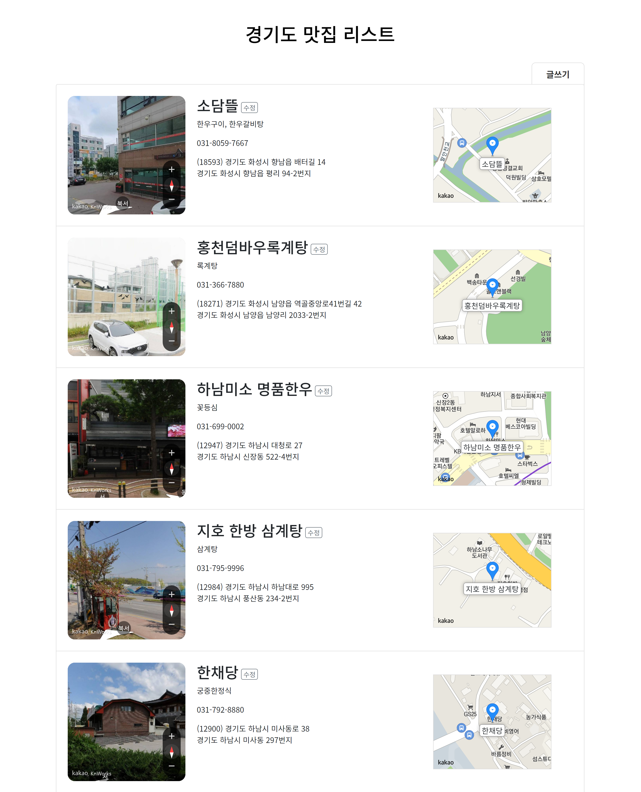

<!--
# restaurant-list
    [](https://github.com/salutJuillet/restaurant-list)
-->


<!-- ABOUT THE PROJECT -->
# restaurant-list

<div align="center">
  
</div>

<br/><br/>


## Built With

* [][React-url]  
* [][NodeJS-url]  
* [][MySQL-url]  
* 카카오 지도 API ([https://apis.map.kakao.com/][kakaoMap-url])  
* 공공데이터포털 ([https://www.data.go.kr/index.do](https://www.data.go.kr/index.do))
<br/><br/>


<!-- GETTING STARTED -->
## Getting Started

### Prerequisites

Before installation you have to import restaurant list data using MySQL. Follow the [MySQL Downloads Guide](https://www.mysql.com/downloads/) to install 
MySQL.


### Installation

1. Clone the repo
   ```sh
   git clone https://github.com/salutJuillet/MyBlog.git
   ```
2. Import sql data [study01_restaurant_ggy.sql]
3. update database\db.json with your MySQL server information
4. Install packages using npm
   ```sh
   npm install
   ```
   
   or yarn
   ```sh
   yarn
   ```
5. Run commands below in terminal using npm
   ```sh
   npm run dev
   ```
   or yarn
   ```sh
   yarn dev
   ```
<br/>


<!-- USAGE EXAMPLES -->
<!--
	# Usage
	Use this space to show useful examples of how a project can be used. Additional screenshots, code examples and demos work well in this space. You may also link to more resources.
-->


<!-- CONTRIBUTING -->
## Contributing

Contributions are what make the open source community such an amazing place to learn, inspire, and create. Any contributions you make are **greatly appreciated**.

If you have a suggestion that would make this better, please fork the repo and create a pull request. You can also simply open an issue with the tag "enhancement".
Don't forget to give the project a star! Thanks again!

1. Fork the Project
2. Create your Feature Branch (`git checkout -b feature/AmazingFeature`)
3. Commit your Changes (`git commit -m 'Add some AmazingFeature'`)
4. Push to the Branch (`git push origin feature/AmazingFeature`)
5. Open a Pull Request
<br/>


<!-- CONTACT -->
## Contact

 salut.juilllet@gmail.com


 [https://github.com/salutJuillet](https://github.com/salutJuillet)


<!-- MARKDOWN LINKS & IMAGES -->
<!-- https://www.markdownguide.org/basic-syntax/#reference-style-links -->
[React-url]: https://reactjs.org/
[NodeJS-url]: https://nodejs.org/
[MySQL-url]: https://www.mysql.com/
[kakaoMap-url]: https://apis.map.kakao.com/
